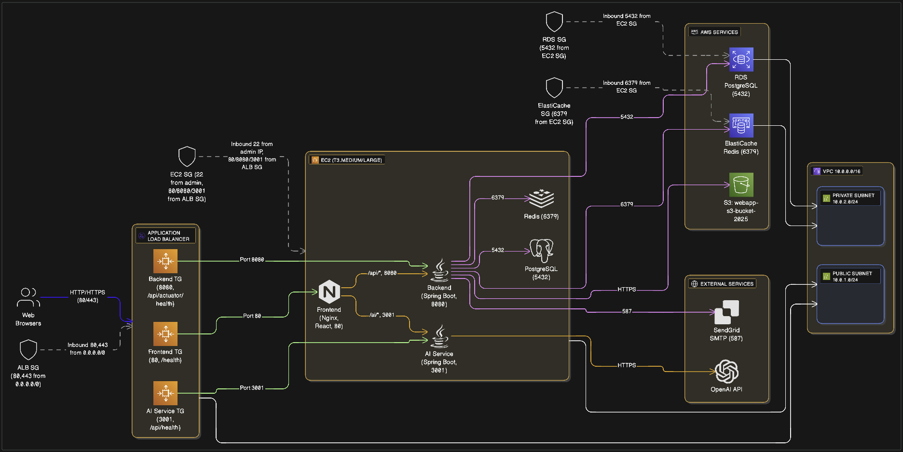

# Campus Marketplace

A campus marketplace for SJSU students to buy and sell items such as textbooks, electronics, gadgets, and essentials. Our team built a full stack web application system by combining multiple services into one clean and modular architecture.

---

## Team Name

**Commandline Commandos**

## Team Members

| Name | Contribution Summary |
|------|----------------------|
| **Vineet Kumar** | Authentication & Authorization Backend Dev, AI Microservice Development, Backend API's integration with Frontend, Initial database design and seed data generation, AWS S3 integration with policies, DevOps & Docker integration between services, Frontend & Backend proxy integration via nginx, AWS ALB Integreation, Team Leadership |
| **Sakshat Patil** | Frontend development, React components, UI/UX design, Marketplace page, Listing details |
| **Lam Nguyen** | Frontend and Backend components, User authentication flow, Profile management, Backend Testing |
| **Wilson Huang** | Backend services, Chat/Messaging system, Search functionality, Admin dashboard API |

## Project Links

- **Project Journal:** [GitHub Wiki](https://github.com/your-repo/wiki) *(Update with actual link)*
- **Sprint Board:** [Google Sheet](https://docs.google.com/spreadsheets/d/your-sheet-id) *(Update with actual link)*

---

# Component Ownership
To divide the work clearly, each team member took responsibility for one major part of the system:

| Team Member | Component Owned |
|-------------|-----------------|
| **Vineet** | Authentication Authorization Backend Dev, Ask AI Feature Dev, AWS Architecture Design, Infrastructure Deployment, S3 File Storage, ALB Integration, Leading Team & Coordination |
| **Lam** | User Management System (backend), Search Integration, Authentication |
| **Sakshat** | Frontend UI (Login, Listings, Management), E2E UI Integration |
| **Wilson** | Listing API, Database Integration, File Upload Service |

---

# Project Journal & Scrum Artifacts

All project documentation is maintained inside the `/project-journal` folder.

| Artifact | Location |
|----------|----------|
| Weekly Scrum Reports | `project-journal/week1...week12` |
| XP Core Values | `project-journal/xp-values.md` |
| Sprint Backlogs (all 6 sprints) | `project-journal/sprint-artifacts/` |
| Task Board Summary | `project-journal/task-board/task-board-summary.md` |
| Burndown Chart Data | `project-journal/burndown/` |

---

# Quick Start

### Using Docker (Recommended)

```bash
# Copy environment template (defaults are already set)
cp env.example .env

# Start all services (includes AI service by default)
docker-compose -f docker-compose.prod.yml up -d

# Frontend: http://localhost
# Backend API: http://localhost:8080/api
# AI Service: http://localhost:3001/api
# Database: localhost:5432
# Redis: localhost:6379
```

**Production Docker Features:**
- Resource limits (CPU/Memory) to prevent runaway processes
- Log rotation (10-50MB max per service)
- Optimized health checks for ALB
- JVM tuning for production workloads
- Network isolation with custom subnet
- Volume labels for backup management

### Local Development

```bash
# 1. Start database and Redis
docker-compose -f docker-compose.prod.yml up -d postgres redis

# 2. Start backend
cd backend
cp ../env.example .env  # Defaults are already set
./run-with-postgres.sh

# 3. Start frontend
cd frontend
npm install
npm run dev
```

### Test Accounts

| Username | Password | Role |
|----------|----------|------|
| test_buyer | password123 | Buyer/Seller |
| test_admin | password123 | Admin |

---

## Architecture



**Detailed AWS Architecture Diagram** showing the complete deployment with Application Load Balancer, EC2 instance, Docker containers, AWS managed services (RDS, ElastiCache, S3), and external integrations.

```
┌─────────────────────────────────────────────────────────────────┐
│                         Users / Internet                        │
└─────────────────────────────────────────────────────────────────┘
                              │
                              ▼
┌─────────────────────────────────────────────────────────────────┐
│                    AWS Application Load Balancer (ALB)          │
│                    HTTP (80) / HTTPS (443)                      │
│                    Health Checks: /health, /api/actuator/health │
└─────────────────────────────────────────────────────────────────┘
                              │
        ┌─────────────────────┼─────────────────────┐
        │                     │                     │
        ▼                     ▼                     ▼
┌──────────────┐    ┌──────────────┐    ┌──────────────┐
│   Frontend   │    │   Backend    │    │ AI Service   │
│  (Nginx:80)  │    │ (Spring:8080)│    │  (Java:3001) │
└──────────────┘    └──────────────┘    └──────────────┘
        │                     │                     │
        └─────────────────────┼─────────────────────┘
                              │
        ┌─────────────────────┼─────────────────────┐
        │                     │                     │
        ▼                     ▼                     ▼
┌──────────────┐    ┌──────────────┐    ┌──────────────┐
│  PostgreSQL  │    │    Redis     │    │   AWS S3     │
│  (Port 5432) │    │  (Port 6379) │    │   Storage    │
│   Database   │    │    Cache     │    │  (Images)    │
└──────────────┘    └──────────────┘    └──────────────┘
        │                     │                     │
        └─────────────────────┴─────────────────────┘
                              │
                    ┌─────────┴──────────┐
                    │   AWS EC2 Instance │
                    │  Docker Containers │
                    │  (All Services)    │
                    └────────────────────┘
                              │
                    ┌─────────┴──────────┐
                    │   SendGrid SMTP    │
                    │  (Email Service)   │
                    └────────────────────┘
```

### Local Development

```
┌─────────────────────────────────────────────────────────────────┐
│                         Frontend                                 │
│              React + Nginx (Docker: Port 80)                     │
│              React + Vite (Local Dev: Port 5173)                 │
└─────────────────────────────────────────────────────────────────┘
                              │
                              ▼
┌─────────────────────────────────────────────────────────────────┐
│                    Unified Backend API                           │
│                   Spring Boot (Port 8080)                        │
├─────────────┬─────────────┬─────────────┬──────────────────────┤
│    Auth     │  Listings   │    Chat     │       Admin          │
│   Module    │   Module    │   Module    │      Module          │
├─────────────┴─────────────┴─────────────┴──────────────────────┤
│                    Shared Services                               │
│         JWT Security │ Email Service │ S3 Storage               │
└─────────────────────────────────────────────────────────────────┘
        │                       │                    │
        ▼                       ▼                    ▼
┌──────────────┐      ┌──────────────┐      ┌──────────────┐
│  PostgreSQL  │      │    Redis     │      │   AWS S3     │
│   Database   │      │    Cache     │      │   Storage    │
│  (Port 5432) │      │  (Port 6379) │      │  (Images)     │
│  Exposed     │      │   Exposed    │      │              │
└──────────────┘      └──────────────┘      └──────────────┘
```

### Tech Stack

| Layer | Technology |
|-------|------------|
| Frontend | React 19, TypeScript, Vite, Tailwind CSS |
| Backend | Spring Boot 3.5, Java 21, Spring Security |
| Database | PostgreSQL 16, Flyway migrations |
| Cache | Redis 7 |
| Storage | AWS S3 |
| Email | SendGrid SMTP |
| Auth | JWT (Access + Refresh tokens) |

---

# Features (Short Summary)

### User Authentication
- JWT-based login with access and refresh tokens
- User registration with email verification
- Password reset via email
- Role-based access control (Buyer, Seller, Admin)

### Marketplace
- Create, edit, and delete product listings
- Browse listings with category filters
- Full-text search with autocomplete
- Multiple images per listing (AWS S3)
- Favorites/wishlist functionality

### Messaging
- Real-time chat between buyers and sellers
- Conversation threads per listing
- Unread message indicators
- Email notifications for new messages

### Email Notifications
- Listing created confirmation
- New message alerts
- Listing rejection notices

### Admin Dashboard
- User management (suspend, reactivate, delete)
- Content moderation and reports
- Platform statistics

---

## API Endpoints

Base URL: `http://localhost:8080/api`

### Authentication
| Method | Endpoint | Description |
|--------|----------|-------------|
| POST | `/auth/login` | User login |
| POST | `/auth/register` | User registration |
| POST | `/auth/refresh` | Refresh access token |
| POST | `/auth/logout` | Logout user |
| POST | `/auth/forgot-password` | Request password reset |

### Listings
| Method | Endpoint | Description |
|--------|----------|-------------|
| GET | `/listings` | Get all listings (paginated) |
| GET | `/listings/{id}` | Get single listing |
| POST | `/listings` | Create new listing |
| PUT | `/listings/{id}` | Update listing |
| DELETE | `/listings/{id}` | Delete listing |

### Images
| Method | Endpoint | Description |
|--------|----------|-------------|
| POST | `/images/upload` | Upload images |
| POST | `/images/listing/{id}` | Upload to specific listing |
| DELETE | `/images/{id}` | Delete image |

### Chat
| Method | Endpoint | Description |
|--------|----------|-------------|
| GET | `/chat/conversations` | Get user conversations |
| POST | `/chat/conversations` | Start new conversation |
| GET | `/chat/conversations/{id}/messages` | Get messages |
| POST | `/chat/conversations/{id}/messages` | Send message |

### Users
| Method | Endpoint | Description |
|--------|----------|-------------|
| GET | `/users/me` | Get current user profile |
| PUT | `/users/me` | Update profile |
| GET | `/users/me/listings` | Get user's listings |

### Favorites
| Method | Endpoint | Description |
|--------|----------|-------------|
| GET | `/favorites` | Get user favorites |
| POST | `/favorites/{listingId}` | Add to favorites |
| DELETE | `/favorites/{listingId}` | Remove from favorites |

### Search
| Method | Endpoint | Description |
|--------|----------|-------------|
| GET | `/search` | Search listings |
| GET | `/search/autocomplete` | Search suggestions |

### Admin
| Method | Endpoint | Description |
|--------|----------|-------------|
| GET | `/admin/dashboard` | Get statistics |
| GET | `/admin/users` | Get all users |
| POST | `/admin/users/{id}/suspend` | Suspend user |
| POST | `/admin/moderate/{listingId}` | Moderate listing |

### Reports
| Method | Endpoint | Description |
|--------|----------|-------------|
| POST | `/reports` | Submit report |
| GET | `/admin/reports` | Get all reports (admin) |

See [API Documentation](docs/api/README.md) for complete reference with request/response examples.

---

## Project Structure

```
├── backend/                 # Spring Boot API (Port 8080)
├── frontend/                # React + Vite + TypeScript
├── ai-integration-server/   # AI chat service (Port 3001)
├── db/                      # Database migrations and scripts
├── docs/                    # Documentation
└── mockdata/                # Mock data for frontend development
```

---

## Environment Variables

All environment variables have **defaults already configured** in `env.example`. Simply copy it to `.env`:

```bash
cp env.example .env
```

### Key Environment Variables (with defaults)

| Variable | Default Value | Description |
|----------|---------------|-------------|
| `DB_APP_USER` | `cm_app_user` | Database username |
| `DB_APP_PASSWORD` | `changeme` | Database password |
| `JWT_SECRET` | `9775e9d9fbc257c6990d59a75430a81c2f9ed364e65ec2da8b927bab5444394d` | JWT signing secret |
| `AWS_S3_BUCKET_NAME` | `webapp-s3-bucket-2025` | S3 bucket for images |
| `AWS_ACCESS_KEY_ID` | `your-aws-access-key-id` | AWS access key |
| `AWS_SECRET_ACCESS_KEY` | `your-aws-secret-access-key` | AWS secret key |
| `SMTP_PASSWORD` | `your-sendgrid-api-key` | SendGrid API key |
| `EMAIL_FROM` | `commandline-commandos@seasonsanta.com` | Email sender |
| `OPENAI_API_KEY` | `your-openai-api-key` | OpenAI API key |

**Note:** For production, override these values in your `.env` file or set them as environment variables.

---

## Development

### Run Tests

```bash
cd backend
./mvnw test
```

### Database Commands

```bash
cd backend
./setup-database.sh      # Create database
./teardown-database.sh   # Remove database
./mvnw flyway:migrate    # Run migrations
```

### Docker Commands

```bash
# Start all services (AI service included by default)
docker-compose -f docker-compose.prod.yml up -d

# View logs
docker-compose -f docker-compose.prod.yml logs -f

# View specific service logs
docker-compose -f docker-compose.prod.yml logs -f backend

# Stop services
docker-compose -f docker-compose.prod.yml down

# Stop and remove volumes (deletes data)
docker-compose -f docker-compose.prod.yml down -v

# Rebuild and restart
docker-compose -f docker-compose.prod.yml up -d --build
```

---

## Documentation

| Document | Description |
|----------|-------------|
| [Backend README](backend/README.md) | Backend setup and API details |
| [Frontend README](frontend/README.md) | Frontend development guide |
| [Database README](db/README.md) | Database setup and migrations |
| [API Documentation](docs/api/README.md) | Complete API reference |
| [Deployment Guide](docs/DEPLOYMENT_GUIDE.md) | Production deployment |

---

## Troubleshooting

| Issue | Solution |
|-------|----------|
| Port 80 in use | `sudo lsof -ti:80 \| xargs kill -9` or change `FRONTEND_PORT` in `.env` |
| Port 8080 in use | `lsof -ti:8080 \| xargs kill -9` or change `BACKEND_PORT` in `.env` |
| Database connection failed | `docker-compose -f docker-compose.prod.yml up -d postgres redis` |
| Containers unhealthy | Check logs: `docker-compose -f docker-compose.prod.yml logs` |
| Out of memory | Increase Docker Desktop memory limits or reduce resource limits in `docker-compose.prod.yml` |

---
